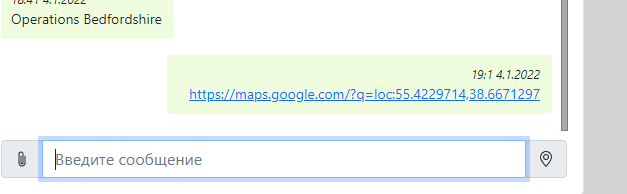
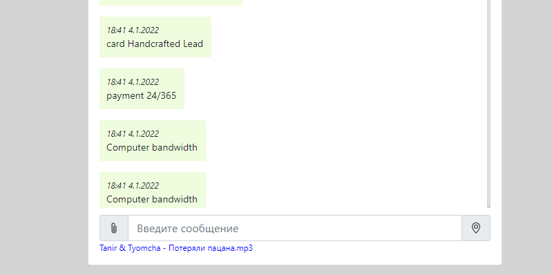
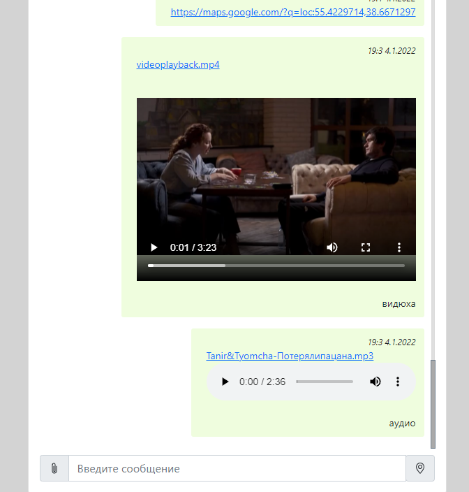
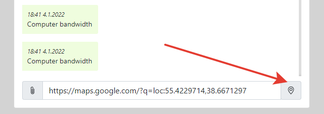
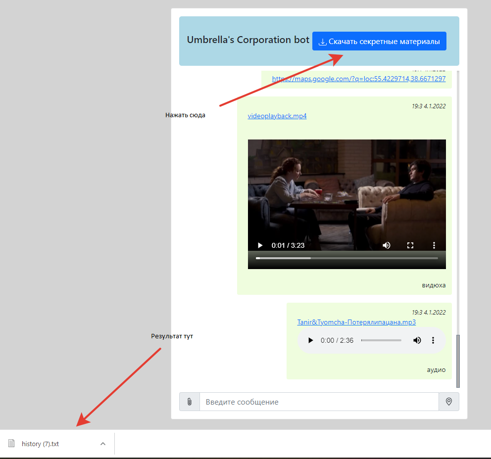

# Links:
  
front: https://github.com/yanach25/ahj-diploma-front.git  
back: https://github.com/yanach25/ahj-diploma-back.git  
gh-pages: https://yanach25.github.io/ahj-diploma-front/
# Диплом
## Реализованные фичи (обязательные):  
- Сохранение в истории ссылок и текстовых сообщений  
- Ссылки (то, что начинается с http:// или https://) должны быть кликабельны и отображаться как ссылки  
  
- Сохранение в истории изображений, видео и аудио (как файлов) - через Drag & Drop и через иконку загрузки (скрепка в большинстве мессенджеров)
  
  #### Внимание! для удаления подгруженного файла нажмите на него
  
- Скачивание файлов (на компьютер пользователя)  
- Ленивая подгрузка: сначала подгружаются последние 10 сообщений, при прокрутке вверх подгружаются следующие 10 и т.д.  
  
## Дополнительно:
- Синхронизация - если приложение открыто в нескольких окнах (вкладках), то контент должен быть синхронизирован
- Воспроизведение видео/аудио (используя API браузера)
- Отправка команд боту, например: @chaos: погода, бот должен отвечать рандомный прогноз погоды
  Доступны следующие команды: `@chaos: dating` - знакомства; `@chaos: joke` - шутки; `@chaos: aphorism`- афоризмы; `@chaos: weather` - погода; `@chaos: news` - новости; `@chaos: help` - помощь
- Отправка геолокации  
    
- Экспорт истории чата (импорт не реализован, поскольку в случае отсутствия файла, пристутвующего в импортируемом файле, отображать будет нечего, фича бесполезная, извините)  
  
